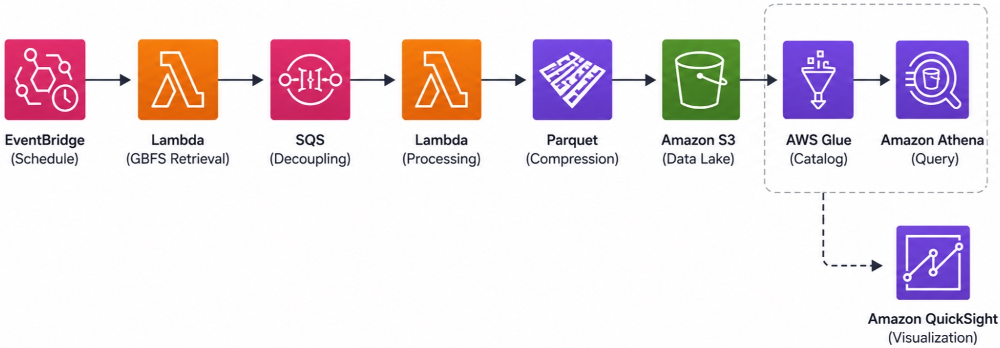

# GBFS Data Lake Pipeline on AWS

A serverless, event-driven data pipeline that ingests **General Bikeshare Feed Specification (GBFS)** data, processes and validates records, stores them as optimized **Parquet** datasets in Amazon S3, and enables SQL analytics through **AWS Glue** and **Amazon Athena**.

<p align="center">
  
</p>

---

## Architecture

- **Infrastructure as Code (IaC)** using AWS CloudFormation (Python CDK)
- **Event-driven** scheduling with Amazon EventBridge
- **Decoupled** ingestion and processing using Amazon SQS
- **Serverless** compute with AWS Lambda
- **Columnar Parquet** storage with PyArrow compression
- **Partitioned S3 Data Lake** optimized for Athena
- **Metadata catalog** with AWS Glue
- **SQL analytics** through Amazon Athena
- Ready for visualization with Amazon QuickSight

---


---

## Features

- Hourly automated GBFS ingestion
- Event-driven, serverless architecture
- Queue-based decoupling for resilience and scalability
- Schema validation and data normalization
- Compressed Parquet output for cost-efficient storage
- Time-partitioned datasets for efficient Athena queries
- Infrastructure fully deployed through CloudFormation (Python CDK)

---

## S3 Partitioning

```text
s3://gbfs-data/
└── city=<city>/
    └── station_status/
        └── year=<yyyy>/
            └── month=<mm>/
                └── day=<dd>/
                    └── hour=<hh>/
                        └── *.parquet
```

---

## Tech Stack

- AWS CloudFormation (Python CDK)
- Amazon EventBridge
- AWS Lambda
- Amazon SQS
- Amazon S3
- AWS Glue
- Amazon Athena
- Python
